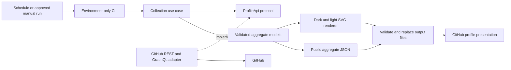

<p align="center">
  <picture>
    <source media="(prefers-color-scheme: dark)" srcset="https://raw.githubusercontent.com/itsmfknlucy/itsmfknlucy/production/assets/profile-dark.svg" />
    
  </picture>
</p>

<h3 align="center">Lucifer Rodstark, Ph.D.</h3>

<p align="center">
  Enterprise Software Architect · Lead Full Stack .NET Engineer · Cloud & AI Solutions Engineer
</p>

<p align="center">
  Building enterprise-grade software, AI-powered systems, and agentic operating structures for software engineering, research, and business execution.
</p>

<p align="center">
  <a href="https://github.com/Rodstark-Global-Solutions-Inc">Rodstark Global Solutions</a>&nbsp;&nbsp;·&nbsp;&nbsp;
  <a href="https://github.com/NexGen-LAVA-Inc">NexGen LAVA</a>&nbsp;&nbsp;·&nbsp;&nbsp;
  <a href="https://github.com/FrostByte-Constructs-LLC">FrostByte Constructs</a>
</p>

---

I build systems designed to survive real production pressure: enterprise applications, integrations, payroll and workforce platforms, AI-assisted engineering workflows, and agentic operating systems that coordinate specialized roles instead of relying on one overloaded assistant.

My work sits at the intersection of enterprise software architecture, full-stack .NET engineering, cloud infrastructure, legacy modernization, AI systems, and agentic execution. The objective is not merely to produce code—it is to create systems with explicit boundaries, reliable data flow, controlled change, measurable quality, and operational durability.

> Build software and AI systems that execute with discipline, memory, verification, and scale.

## Current Direction

| Focus | Engineering intent |
|---|---|
| Enterprise Software Architecture | Maintainable business systems with deliberate boundaries and governance |
| Full Stack .NET Engineering | C#, .NET, SQL Server, Angular, APIs and cloud services |
| Legacy Modernization | Practical migration paths across VB6, VB.NET, C# and established integrations |
| Agentic Engineering | Specialized planning, implementation, QA, security, performance and documentation roles |
| Academic Research Systems | Methodology, source validation, citation control and research integrity |
| Company Operating Systems | Coordinated departmental workflows with controlled execution |
| AI-Native Personal Platforms | LucyAI, Agentics, portfolio and knowledge systems |

## The Stack

| Layer | Focus | Responsibility |
|---|---|---|
| Control | Agentic OS | Task routing, verification gates, approval boundaries and memory |
| Architecture | Enterprise Systems | Explicit system boundaries, operational constraints and reliable data flow |
| Engineering | Full Stack .NET | C#, ASP.NET Core, VB.NET, SQL Server, Angular and APIs |
| Integration | Legacy + Modern Systems | Services, databases, pipelines and modernization |
| Automation | DevOps + CI/CD | GitHub, Azure DevOps and controlled releases |
| Intelligence | AI + Agentic Workflows | Planning, context, retrieval and verified execution |
| Research | Academic OS | Evidence, methodology and academic integrity |
| Business | Company OS | Cross-department workflows and governance |

## What I Build

Enterprise internal platforms; payroll, attendance, HRIS and workforce systems; insurance and policy integrations; finance and banking applications; healthcare staffing platforms; cloud-native and hybrid systems; legacy modernization; AI-assisted engineering; agentic operating systems; research automation; and portfolio/knowledge platforms.

## Operating Philosophy

```text
Architecture before acceleration.
Verification before confidence.
Context before execution.
Systems before scattered tools.
Discipline before scale.
```

Establish context, define constraints, design the architecture, execute in bounded stages, verify the result, and preserve the decisions that future work depends on.

## Organizations

**[Rodstark Global Solutions, Inc.](https://github.com/Rodstark-Global-Solutions-Inc)** — software, AI systems, enterprise solutions and agentic operating structures.

**[NexGen LAVA, Inc.](https://github.com/NexGen-LAVA-Inc)** — SaaS platforms, management systems and enterprise business applications.

**[FrostByte Constructs LLC](https://github.com/FrostByte-Constructs-LLC)** — Discord bots, APIs, automation tools, cybersecurity research and software utilities.

---

<details>
<summary><strong>Behind this profile · architecture, metric definitions and maintenance</strong></summary>

## Repository purpose

This repository contains the public profile and a Python publishing pipeline that generates its theme-aware identity cards. It is not the source repository for every project mentioned above and does not expose their private implementation details.

**Reviewed snapshot:** [`88ca7ff`](https://github.com/itsmfknlucy/itsmfknlucy/tree/88ca7ff0b8226f2c00e0cddb41f2737377f61321), `production`, on 9 September 2026. The documentation review inspected the CLI, API adapter, aggregation flow, models, renderer interface, workflow and README contract. It was not a new authenticated collection or full test execution.

## Architecture



This is a small ports-and-adapters publishing pipeline. It has no web server, HTTP controllers, database, or application deployment to invent.

| Boundary | Source | Responsibility |
|---|---|---|
| Controller / composition root | [`cli.py`](profile_generator/cli.py), [`__main__.py`](profile_generator/__main__.py) | Read environment, construct clients, collect, render and publish |
| Application use case | [`collector.py`](profile_generator/collector.py) | Verify authenticated identity, merge inventories, enforce coverage gates and aggregate activity |
| Domain models | [`models.py`](profile_generator/models.py) | Immutable aggregates and validation; public serialization excludes repository-level identifiers |
| Outbound port | `ProfileApi` in `collector.py` | Abstract authenticated-user, inventory, activity and contribution operations |
| Infrastructure adapter | [`api.py`](profile_generator/api.py) | Paginated REST inventory, GraphQL contributions, bounded retries and contributor statistics |
| Presentation | [`render.py`](profile_generator/render.py), [`portrait.py`](profile_generator/portrait.py) | Deterministic theme-aware SVG with embedded portrait source |
| Delivery | [Profile workflow](.github/workflows/profile-stats.yml) | Tests, compilation, generation, hygiene checks and narrowly staged output commits |

### Entry-point contracts

| Entry point | Input / behavior |
|---|---|
| `python -m profile_generator` | Environment configuration; no required third-party Python dependency installation is defined in this repository |
| `Config.from_env()` | Requires login and one or more token sources; deduplicates tokens and validates the repository floor |
| `collect_profile_stats(...)` | Injected `ProfileApi` clients, expected login, required owners and minimum inventory count |
| `render_all(stats)` | Validated aggregate model → dark/light SVG strings |
| `write_outputs(...)` | Validate both SVGs and public JSON before replacing each destination |

## What the metrics mean

| Metric | Actual calculation / scope |
|---|---|
| Repository inventory | Deduplicated by repository ID across owner, organization-member and collaborator listings |
| Commit total | Default-branch commit history in owned and organization-member repositories; **not exclusively commits authored by this user** |
| Authored line changes | GitHub contributor-statistics additions/deletions for the authenticated user in that same activity scope |
| Net lines | Additions minus deletions; **not a count of the current source tree** |
| Contributions | Visible contribution categories plus restricted contributions, queried in calendar-year windows from account creation |
| Collaborator repositories | Included in inventory; excluded from the repository commit/line aggregation loop |
| `coverage: COMPLETE` | All configured coverage checks succeeded for the enumerated, credential-visible scope—not proof of access to every repository that exists |
| Freshness | The `generated_at` field in [`generated/profile-stats.json`](generated/profile-stats.json), not the time a viewer opens the README |

Required-owner representation and a minimum repository count help detect lost access, but cannot prove that no inaccessible repository is missing. Private activity is published as aggregates, not private repository names or file contents.

## Maintenance

The checked-in workflow selects **Python 3.13**. Run repository checks before authenticated generation:

```bash
python -m unittest discover -s tests -v
python -m compileall -q profile_generator tests
```

Supply credentials through encrypted Actions secrets or the local process environment—never in committed files or command-line history.

| Variable | Purpose |
|---|---|
| `PROFILE_LOGIN` | Expected authenticated account |
| `PROFILE_STATS_TOKEN` | Optional single token source |
| `PROFILE_STATS_TOKENS` | Newline-separated additional token sources |
| `PROFILE_REQUIRED_OWNERS` | Comma-separated owner coverage gate |
| `PROFILE_MIN_REPOSITORIES` | Non-negative inventory floor; CLI default `0`, workflow fallback `18` |

After supplying the environment:

```bash
python -m profile_generator
git diff --check
```

The workflow runs on a daily `17 4 * * *` schedule, manual dispatch and specified `production` path changes. A README commit can therefore trigger the existing workflow. Without configured profile credentials, tests still run and the generated assets are preserved. With credentials, the workflow stages only the two SVGs and aggregate JSON; it does not rewrite this biography.

## Implementation and assurance

- [x] Environment-only configuration and injectable API clients
- [x] Paginated inventory, repository-ID deduplication and required-owner checks
- [x] Validated aggregate models and identifier-free public serialization
- [x] Dark/light identity-card renderer and existing banner
- [x] XML validation before publication and atomic replacement of each file
- [x] Unit/contract test source and scheduled CI publication
- [ ] Independent confirmation that configured credentials cover every intended repository
- [ ] Cross-file transactional publication, should that stronger guarantee become necessary

**Publication boundary:** each `os.replace` is atomic for one destination. The three output replacements are not one filesystem transaction; do not describe them as an all-or-nothing group. No fresh collection or test result is claimed by this README edit.

## Repository map

```text
.github/workflows/       Scheduled build and publication
assets/                  Existing banner and generated dark/light identity cards
generated/               Public aggregate statistics JSON
profile_generator/       CLI, collection, API, models, portrait and rendering
tests/                   API, CLI, aggregation, model, rendering and repository contracts
README.md                Public profile and this maintenance guide
LICENSE                  Project license
```

See [`LICENSE`](LICENSE). Keep tokens, private repository identifiers and raw API payloads out of public artifacts. Preserve the identity-card alternative text, both color-scheme sources, banner and section names enforced by [`test_repository_contract.py`](tests/test_repository_contract.py).

</details>

---

<p align="center">
  
</p>
